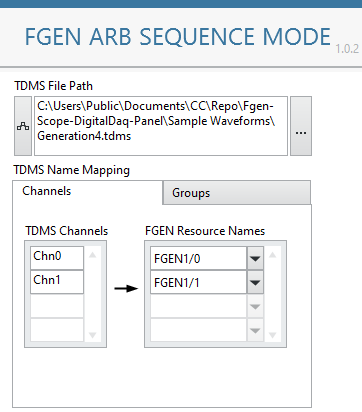
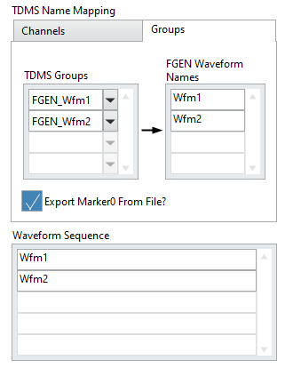
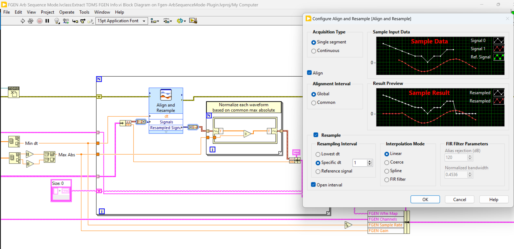
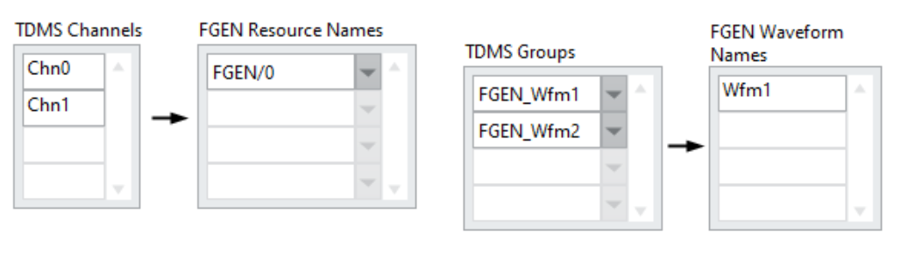

# NI FGEN Arbitrary Sequence Mode Plugin (Work In Progress)

## Contents

- [Overview](#overview)
- [How Does It Work](#how-does-it-work)
    - [TDMS File Preparation](#tdms-file-preparation)
    - [Configuration on the Plugin Panel](#configuration-on-the-plugin-panel)
    - [Resampling and Normalization](#resampling-and-normalization)
- [Hardware Dependencies](#hardware-dependencies)
- [Software Dependencies](#software-dependencies)

## Overview

This InstrumentStudio measurement plugin runs the NI FGEN in **arbitrary sequence mode** with single trigger mode. In this mode, FGEN generates a sequence of arbitrary waveforms and optionally exports a `Marker0` event for each waveform step in the sequence. Route this `Marker0` event to an NI PXI instrument to synchronize each step.

The following picture shows an example of running this plugin as a small panel (right) with NI Scope as a large panel (left). The oscilloscope is configured to use `/FGEN1/0/Marker0Event` as its digital trigger source.

This plugin supports only a single instrument session (multiple channels are allowed, but all must be within one instrument).

## How Does It Work
### TDMS File Preparation

This plugin reads waveforms from a TDMS file. This [file format](https://www.ni.com/en/support/documentation/supplemental/06/introduction-to-labview-tdm-streaming-vis.html) organizes data in three levels of hierarchy: `Root`, `Group`, and `Channel`. Waveforms are stored in `Channel`s.

By treating a `Group` as one waveform group unit and the `Channel`(s) under it as corresponding FGEN channels, you can configure a waveform sequence based on the waveforms mapped to the TDMS waveform groups.

For example, the TDMS file below has two `Group`s: *FGEN_Wfm1* and *FGEN_Wfm2*, each with two `Channel`s. You can optionally create a `Custom Properties` named *Marker0InSeconds* on each `Group` to define the FGEN Marker0 event location shared by both `Channel`s.

([Sample TDMS file](Sample%20Waveforms/Generation4.tdms) opened in NI DIAdem software.)

### Configuration on the Plugin Panel

On the plugin panel, specify the TDMS file to use, then map the TDMS `Channel` to FGEN Channel as shown below.

Map the TDMS `Group` to *FGEN Waveform Names* as shown below. **FGEN accepts only alphanumeric names that do not begin with a number**. Then define the *Waveform Sequence* using these *FGEN Waveform Names* in any order and with any number of repetitions.

Optionally, tick the *Export Marker0 From File?* checkbox to use the Marker0 event location as defined in the file.

Click the **RUN** button to start generating the waveform sequence. It generates only once.

### Resampling and Normalization

To run all FGEN channels simultaneously, they must share the same sample rate. The plugin uses **the highest sample rate of all waveforms** specified in the *TDMS Name Mapping* on the panel. Waveforms are resampled using the "Align and Resample" Express VI with the configuration shown below. Find the VI documentation [here](https://www.ni.com/docs/en-US/csh?context=lvcore_lvexpress_align_and_resample).

FGEN accepts waveform data with values between -1 and 1, and then uses the `Gain` and `Offset` settings to further amplify the signal. The plugin normalizes all waveforms against the maximum absolute value of all waveforms and applies the scaling back to the FGEN `Gain` setting. `Offset` is not configured and remains zero.

Note the effects of resampling and normalization:

* The FGEN `Marker0` location is specified in unit of sample index. The `Marker0InSeconds` in the TDMS file will be convert to `Marker0` by multiplying to the highest sample rate.
* Shorter waveforms are extended to the longest waveform in the respective `Group` with 0V padding.
* Normalization may reduce amplitude accuracy for small signals if the maximum absolute value is relatively large.
* The highest sample rate for resampling and the maximum absolute value for normalization are based on waveforms set according to the *TDMS Name Mapping* setting. We recommend removing unused channel or group mappings for better signal integrity.
   * If a TDMS `Channel` or `Group` is specified but missing a mapping to FGEN, it is ignored. You can remove unused FGEN channels or waveforms as shown below:

## Hardware Dependencies

Not all NI FGEN models support arbitrary sequence mode. Check the features supported documentation [here](https://www.ni.com/docs/en-US/bundle/ni-fgen/page/devices.html).

## Software Dependencies

- InstrumentStudio Pro (2025 Q4 or higher)
- NI-FGEN (2025 Q4 or higher)
- LabVIEW 2025

