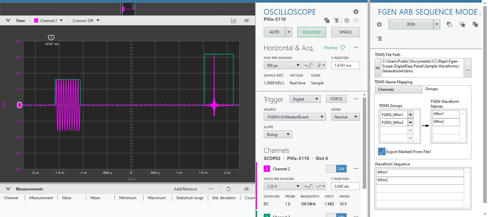
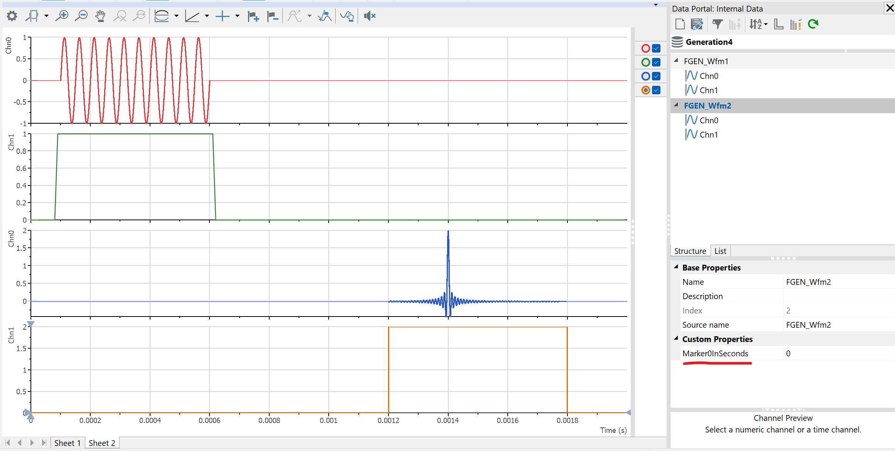

# NI FGEN Arbitrary Sequence Mode Plugin (Work In Progress)

## Contents

- [Overview](#overview)
- [How Does It Work](#how-does-it-work)
    - [TDMS File Preparation](#tdms-file-preparation)
    - [Configuration on the Plugin Panel](#configuration-on-the-plugin-panel)
    - [Resampling and Normalization](#resampling-and-normalization)
- [Hardware Dependencies](#hardware-dependencies)
- [Software Dependencies](#software-dependencies)

## Overview

This InstrumentStudio measurement plugin will run the NI FGEN with arbitrary sequence mode and single trigger mode. Under this mode, FGEN generates a sequence of arbitrary waveforms, and optionally exporting Marker0 event for each waveform step in the sequence. Route this Marker0 event to an NI PXI instrument to synchronize at each step.

Following picture shows an example of running this plugin as small panel (right), with NI Scope as large panel (left). The oscillocope is configured to use `/FGEN/0/Marker0Event` as its digital trigger source.

This plugin only supports single instrument session (allow multiple channels, but all must be within one single instrument).

## How Does It Work
### TDMS File Preparation

This plugin read the waveforms from a TMDS file. This [file format](https://www.ni.com/en/support/documentation/supplemental/06/introduction-to-labview-tdm-streaming-vis.html) organizes data in three levels of hierarchy - `Root`, `Group` and `Channel`. The waveforms are stored in the `Channel`. 

By treating a `Group` as one waveform group unit and the `Channel`(s) under it to corresponded FGEN channels, user can configure a waveform sequence based on the waveforms mapped to the TDMS waveform groups. 

Take the TDMS file below as an example, it has two TDMS `Group`(s) - *FGEN_Wfm1* and *FGEN_Wfm2*. And each of them has two TDMS `Channel`(s). On top of each `Group`, we can optionally create a `Custom Properties` named as *Marker0*, to define the FGEN marker0 event location that shared by both `Channel`(s).

(TDMS file opened in NI DIAdem software)

### Configuration on the Plugin Panel

On the plugin panel, specify the TDMS file to use. Then, map the TDMS `Channel` to FGEN Channel as shown below.

And map the TMDS `Group` to the *FGEN Waveform Names* as shown below. **The FGEN can only accept the names with alphanumeric character and must not begin with a number**. Then, you can define the *Waveform Sequence* using these *FGEN Waveform Names* in any order and number of repetitions. 

Optionally, tick the *Export Marker0 From File?* checkbox if you want to use the Marker0 event location as defined in the file. 

Click the **RUN* button on above will start the signal generation of the waveform sequence. It will only generate once.

### Resampling and Normalization

To run all the channels in a FGEN at the same time, they must share the same sample rate. The plugin will take **the highest sample rate of all the waveforms** specified in the *TDMS Name Mapping* on the panel. The waveforms read from the file will be resampled first using the "Align and Resample" Express VI with configuration shown below. Find out the VI documentation [here](https://www.ni.com/docs/en-US/csh?context=lvcore_lvexpress_align_and_resample). 

Meanwhile, the FGEN can only accepts waveform data with value between -1 to 1, and then use the `Gain` and `Offset` setting to further amplify the signal. So, the plugin will first normalize all waveforms against the maximum absolute of the all the waveforms, and then apply back the scaling to the FGEN `Gain` setting. `Offset` is not configured and remained zero. 

Please take note of the effect due to the resampling and normalization:

* The `Marker0` location (unit: sample index) defined in the TDMS file will be based on the highest sample rate. 
* The shorter waveforms will be extended to the longest waveform in the respective `Group', with 0V. 
* Normalization may result less amplitude accuracy for small signal if the maximum absolute is relatively very large. 
* The highset sample rate for resampling and the maximum absolute for normalization are based on the waveforms set according to the *TDMS Name Mapping* setting. Therefore, it is recommended to remove those unused channel mapping or group mapping for better signal integrity. 
   * If a TDMS `Channel` or `Group` is specified but missing the mapping to FGEN, it will be ignored. As shown below, you may just remove the unused FGEN channel or waveform like this:

## Hardware Dependencies

Not all the NI FGEN models support arbitrary sequence mode. Check out the features supported documentation form [here](https://www.ni.com/docs/en-US/bundle/ni-fgen/page/devices.html).

## Software Dependencies

- InstrumentStudio Pro (2025 Q4 or higher)
- NI-FGEN (2025 Q4 or higher)
- LabVIEW 2025

